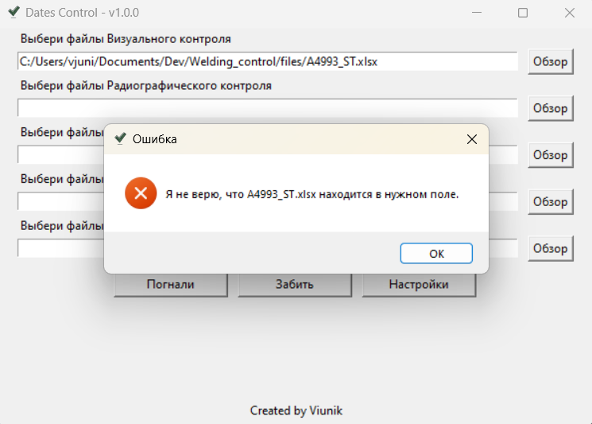

# Welding_control v1.0.0

## Оглавление
- [Описание](#Описание)
- [Принцип работы](#Принцип-работы)
- [Инструкция по установке для Windows](#Инструкция-по-установке-для-Windows)
  - [Простой способ](#Простой-способ)
  - [Сложный способ](#Сложный-способ)
- [Инструкция по использованию](#Инструкция-по-использованию)
- [Что нового](#Что-нового)

## Описание

Это некоммерческое приложение, которое разработано для ООО "Алитер-Акси".
Оно предназначено для проверки правильности заполнения протоколов неразрушающего контроля сварных соединений, подготовленных в формате xlsx. <br> 
Согласно п.3.8.1 РД 26-02-80-2004 порядок проведения контроля неразрушающими методами (из основных в ООО "Алитер-Акси") таков:<br>
1. Визуальный и измерительный контроль (ВИК)
2. Замер твердости
3. Стилоскопирование
4. Ультразвук и/или радиография
5. Цветная дефектоскопия

<br>В связи с человеческим фактором и большим количеством сварных соединений (в особо крупных проектах их до 20 000) появляются ошибки в оформлении того или иного протокола неразрушающего контроля, а именно в указанной дате контроля шва и нарушению порядка контроля. Это ведет к рекламациям.
<br>Чтобы этого избежать, была разработана эта программа.<br>

<br><br><b>Примечания:</b> 
- Приложение написано целиком на языке Python. Из сторонних библиотек использовались только `openpyxl` и `pyinstaller`
- на данный момент приложение работает только на Windows

## Принцип работы
Для каждого из указанных в описании методов контроля подгружается один или несколько файлов с неограниченным количеством листов в каждом файле. Приложение выполняет следующие действия:
1. Пробегается по первым 10 строчкам первого листа каждого файла в поисках частей слов маркеров, чтобы убедиться, что это именно тот файл, который нужен и что он подгружен в правильном месте. Например, для подгруженных в разделе ВИК файлов, приложение ищет совпадение с `визуальн`, поскольку такая часть слова есть в первых 10 строчках любого протокола ВИК. Тут нет надобности пробегать по каждому листу, так как на практике еще не встречалось, чтобы в одном протоколе было несколько различных типов контроля.
2. Далее уже пробегается по каждой строке каждой страницы каждого файла каждого вида контроля и ищщет номера швов, которые удовлетворяют условиям регулярного выражения: Номер шва всегда начинается с кириллической буквы С, Н, Т, У (или их аналогов в латинице) или N. Далее следует случайный набор цифр чередующихся с дефисами.
3. Для каждого шва меняется буква латиницы на аналогичную букву кириллицы.
4. При нахождении шва, программа в той же самой строке ищет дату контроля этого шва. Под датами подразумевается 1-2 цифры дня, 1-2 цифры месяца и 2/4 цифры года, разделенные при помощи `.`, `-`, `/` без букв в этой ячейке.
5. При нахождении даты, данные заносятся во временный словарь. Структура словаря выглядит так:
```json
{
    <номер_шва1>: {
        <тип_контроля1>: <дата_контроля>,
        <тип_контроля2>: <дата_контроля>,
        ................
    },
    <номер_шва2>: {
        <тип_контроля1>: <дата_контроля>,
        <тип_контроля2>: <дата_контроля>,
        ................
    },
    ................
}
```
6. После просмотра всех файлов и окончательного формирования словаря приложение проверяет порядок контроля каждого шва по его датам. Если найдено несоответствие, то это записывается в примечания, которые будут указаны для каждого шва при формировании результирующей таблицы. Порядок проверки такой:<br>
6.1 Если для шва не указана дата ВИК - это вносится в примечания, проверка этого шва прерывается и приложение переходит к следующему шву.<br>
6.2 Далее проверяется замер твердости. Если он проведен раньше ВИК, то это добавляется к замечаниям для шва. Здесь и далее в отличие от 5.1 проверка не прерывается и не переходит к следующему шву. Продолжается остальных дат контроля этого же шва.<br>
6.3 Проверяется стилоскопирование. Эсли оно проведено раньше ВИК, это указывается в примечаниях.<br>
6.4 Проверяется стилоскопирование. Эсли оно проведено раньше замера твердости, это указывается в примечаниях.<br>
6.5 Проверяется УЗК и Радиография. Если они проведены раньше ВИК, это указывается в примечаниях.<br>
6.6 Проверяется УЗК и Радиография. Если они проведены раньше замеров твердости, это указывается в примечаниях.<br>
6.7 Проверяется УЗК и Радиография. Если они проведены раньше стилоскопирования, это указывается в примечаниях.<br>
6.8 Проверяется Цветная дефектоскопия. Если она проведена раньше ВИК, это указывается в примечаниях.<br>
6.9 Проверяется Цветная дефектоскопия. Если она проведена раньше замеров твердости, это указывается в примечаниях.<br>
6.10 Проверяется Цветная дефектоскопия. Если она проведена раньше стилоскопирования, это указывается в примечаниях.<br>
6.11 Проверяется Цветная дефектоскопия. Если она проведена раньше Радиографии или УЗК, это указывается в примечаниях.<br>
7. Как только для одного шва проверка закончилась, информация о нем, включая собранные примечания, вносится в результирующую таблицу и приложение переходит к следующему шву до тех пор, пока все швы из временного словаря не будут проверены.

## Инструкция по установке для Windows

### Простой способ
1. Скачать к себе в отдельную папку в любом месте исполняемый `exe` файл.
2. Запустить исполняемый `exe` файл.

### Сложный способ
1. Скачать и установить Python версии не ниже 3.10
2. Склонировать репозиторий к себе c Гитхаба.
```
git clone git@github.com:AlekseiViunik/Welding_control.git
```
3. Перейти в корневую директорию проекта в терминале.
```
cd <путь_к_корневой_директории>
```
4. Активировать виртуальное окружение.
```
source venv/Scripts/activate
```
5. Установить зависимости.
```
pip install -r requirements.txt
```
6. (опционально) Сгенерировать исполняемый файл.<br>
Вместо YourAppName подставить имя, которое будет использоваться в названии исполняемого файла.<br><br>
```
pyinstaller --onefile --windowed --add-data "settings;settings" --add-data "icons;icons" --add-data "logic;logic" --add-data "gui;gui" --add-data "logging_files;logging_files" -n YourAppName main.py
```

7. Если п.6 пропущен, запустить приложение через терминал.
```
python main.py
```
8. Если п.6 выполнен, то в корневой директории появится папка `dist` с исполняемым файлом - запустить его.

## Инструкция по использованию
После запуска файла запустится окно:<br>
<br>

1. В верхнем левом углу указано имя приложения и его версия. Имя постоянное. Оно не будет меняться в зависимости от того, какое Вы имя назначите исполняемому файлу.
2. Далее идут 5 текстовых полей для ввода с подсказкой над каждым и кнопкой `Обзор` слева. Сюда вносятся пути к файлам для проверки. Вручную их вносить необязательно. Достаточно нажать кнопку обзор для выбора <u>одного или нескольких сразу</u> файлов одного типа контроля. Также невостребованные поля можно оставить пустыми. Приложение их проигнорирует.
3. Кнопка `Погнали` запускает процесс проверки, который может занять до нескольких минут. на время проверки появится окно, предупреждающее о том, что проверка началась и исчезнет само по окончании проверки:<br>
<br>
По окончании проверки и создании результирующей таблицы появится еще одно информирующее окно, которое скажет, что работа выполнена и укажет, где сохранена результирующая таблица. Это окно нужно закрыть подтверждением, нажав кнопку `OK`:<br>
<br>
4. Кнопка `Забей` очищает все заполненные поля.
5. Кнопка `Настройки` открывает окно настроек:<br>
<br>

На данный момент в настройках можно только указать папку, куда будет сохранена результирующая таблица.

Нюансы:
1. Не надо запускать в работу файлы по нескольким договорам сразу. Один договор - один анализ. В разных договорах могут повторяться номера швов и это может привести к неправильной работе приложения.
2. Можно одновременно выбирать сразу несколько файлов одного и того же вида контроля. Они должны находиться в одной и той же папке. Выбор нескольких файлов необходимо делать в окне обзора файлов с зажатой `Ctrl` для добавления к выбору еще одного файла или `Shift` для добавления сразу диапазона идущих подряд файлов.
3. Необходимо выбирать файлы конкретного типа контроля в поле, которое предназначено для этого типа контроля. Если написано `Выберите файлы Стилоскопирования`, то не надо в это поле пихать протоколы замеров твердости, иначе выскочит окно с ошибкой при нажатии на кнопку `Погнали`:<br>

4. В каждом файле может быть сколько угодно страниц. Главное, чтобы это были страницы с одним и тем же типом контроля.
5. На каждой странице может быть сколько угодно номеров швов. Главное, чтобы в первых 10 строчках на первой странице был текст, указывающий на тип контроля. Это не надо вручную проверять. Если текста не будет, выскочит ошибка п.3
6. Номера швов везде должны быть указаны в столбце А. Если ячейки с номерами швов объединены несколькими столбцами, то первым должен быть столбец А в объединении. Это тоже не надо проверять вручную. Если номера швов будут в другом столбце, то приложение их просто не найдет.
7. Дата контроля шва должна быть справа от шва в той же строке.


## Что нового

### v1.0.0
- Это самая первая версия. Тут никаких изменений, фиксов и дополнений.

