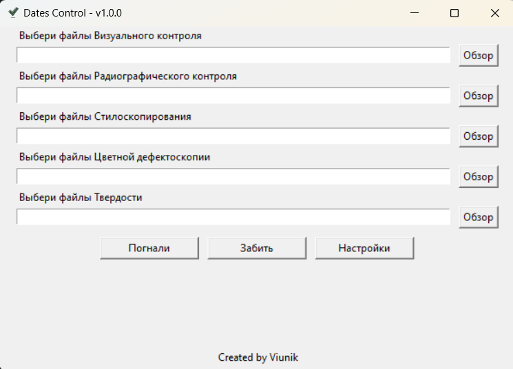
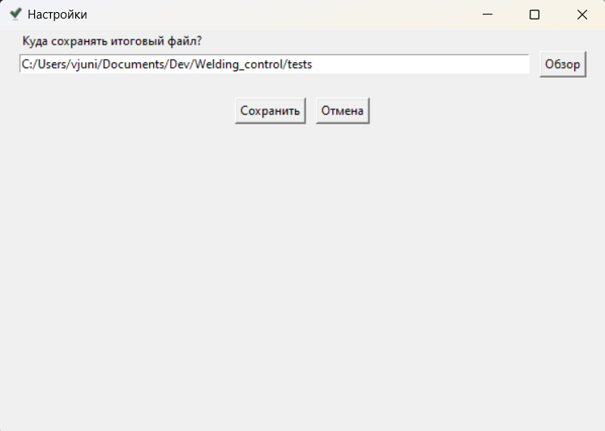

# iWant v1.1.0

## Оглавление/Table of Contents/Sommario
- [Описание](#Описание)
- [Принцип работы](#Принцип-работы)
- [Инструкция по установке для Windows](#Инструкция-по-установке-для-Windows)
  - [Простой способ](#Простой-способ)
  - [Сложный способ](#Сложный-способ)
- [Инструкция по использованию](#Инструкция-по-использованию)
- [Что нового](#Что-нового)
  
  =============================================================
- [Description](#description)
- [Operating Principle](#operating-principle)
- [Installation Instructions for Windows](#installation-instructions-for-windows)
  - [Easy Way](#easy-way)
  - [Advanced Way](#advanced-way)
- [Usage Instructions](#usage-instructions)
- [What's New](#whats-new)
  
  =============================================================
- [Descrizione](#descrizione)
- [Principio di funzionamento](#principio-di-funzionamento)
- [Istruzioni di installazione per Windows](#istruzioni-di-installazione-per-windows)
  - [Metodo semplice](#metodo-semplice)
  - [Metodo complesso](#metodo-complesso)
- [Istruzioni per l'uso](#istruzioni-per-luso)
- [Cosa c'è di nuovo](#cosa-cè-di-nuovo) 

## Описание

Это некоммерческое приложение, которое разработано для ООО "Алитер-Акси".
Оно предназначено для проверки правильности заполнения протоколов неразрушающего контроля сварных соединений, подготовленных в формате xlsx. <br> 
Согласно п.3.8.1 РД 26-02-80-2004 порядок проведения контроля неразрушающими методами (из основных в ООО "Алитер-Акси") таков:<br>
1. Визуальный и измерительный контроль (ВИК)
2. Замер твердости
3. Стилоскопирование
4. Ультразвук и/или радиография
5. Цветная дефектоскопия

<br>В связи с человеческим фактором и большим количеством сварных соединений (в особо крупных проектах их до 20 000) появляются ошибки в оформлении того или иного протокола неразрушающего контроля, а именно в указанной дате контроля шва и нарушению порядка контроля. Это ведет к рекламациям.
<br>Чтобы этого избежать, была разработана эта программа.<br>

<br><b>Примечания:</b> 
- Приложение написано целиком на языке Python. Из сторонних библиотек использовались только `openpyxl` и `pyinstaller`
- на данный момент приложение работает только на Windows

## Принцип работы
Для каждого из указанных в описании методов контроля подгружается один или несколько файлов с неограниченным количеством листов в каждом файле. Приложение выполняет следующие действия:
1. Пробегается по первым 10 строчкам первого листа каждого файла в поисках частей слов маркеров, чтобы убедиться, что это именно тот файл, который нужен и что он подгружен в правильном месте. Например, для подгруженных в разделе ВИК файлов, приложение ищет совпадение с `визуальн`, поскольку такая часть слова есть в первых 10 строчках любого протокола ВИК. Тут нет надобности пробегать по каждому листу, так как на практике еще не встречалось, чтобы в одном протоколе было несколько различных типов контроля.
2. Далее уже пробегается по каждой строке каждой страницы каждого файла каждого вида контроля и ищщет номера швов, которые удовлетворяют условиям регулярного выражения: Номер шва всегда начинается с кириллической буквы С, Н, Т, У (или их аналогов в латинице) или N. Далее следует случайный набор цифр чередующихся с дефисами.
3. Для каждого шва меняется буква латиницы на аналогичную букву кириллицы.
4. При нахождении шва, программа в той же самой строке ищет дату контроля этого шва. Под датами подразумевается 1-2 цифры дня, 1-2 цифры месяца и 2/4 цифры года, разделенные при помощи `.`, `-`, `/` без букв в этой ячейке.
5. При нахождении даты, данные заносятся во временный словарь. Структура словаря выглядит так:
```json
{
    <номер_шва1>: {
        <тип_контроля1>: <дата_контроля>,
        <тип_контроля2>: <дата_контроля>,
        ................
    },
    <номер_шва2>: {
        <тип_контроля1>: <дата_контроля>,
        <тип_контроля2>: <дата_контроля>,
        ................
    },
    ................
}
```
6. После просмотра всех файлов и окончательного формирования словаря приложение проверяет порядок контроля каждого шва по его датам. Если найдено несоответствие, то это записывается в примечания, которые будут указаны для каждого шва при формировании результирующей таблицы. Порядок проверки такой:<br>
6.1 Если для шва не указана дата ВИК - это вносится в примечания, проверка этого шва прерывается и приложение переходит к следующему шву.<br>
6.2 Далее проверяется замер твердости. Если он проведен раньше ВИК, то это добавляется к замечаниям для шва. Здесь и далее в отличие от 6.1 проверка не прерывается и не переходит к следующему шву. Продолжается остальных дат контроля этого же шва.<br>
6.3 Проверяется стилоскопирование. Эсли оно проведено раньше ВИК, это указывается в примечаниях.<br>
6.4 Проверяется стилоскопирование. Эсли оно проведено раньше замера твердости, это указывается в примечаниях.<br>
6.5 Проверяется УЗК и Радиография. Если они проведены раньше ВИК, это указывается в примечаниях.<br>
6.6 Проверяется УЗК и Радиография. Если они проведены раньше замеров твердости, это указывается в примечаниях.<br>
6.7 Проверяется УЗК и Радиография. Если они проведены раньше стилоскопирования, это указывается в примечаниях.<br>
6.8 Проверяется Цветная дефектоскопия. Если она проведена раньше ВИК, это указывается в примечаниях.<br>
6.9 Проверяется Цветная дефектоскопия. Если она проведена раньше замеров твердости, это указывается в примечаниях.<br>
6.10 Проверяется Цветная дефектоскопия. Если она проведена раньше стилоскопирования, это указывается в примечаниях.<br>
6.11 Проверяется Цветная дефектоскопия. Если она проведена раньше Радиографии или УЗК, это указывается в примечаниях.<br>
7. Как только для одного шва проверка закончилась, информация о нем, включая собранные примечания, вносится в результирующую таблицу и приложение переходит к следующему шву до тех пор, пока все швы из временного словаря не будут проверены.

## Инструкция по установке для Windows

### Простой способ
1. Скачать к себе в отдельную папку в любом месте исполняемый `exe` файл любой версии [отсюда](https://github.com/AlekseiViunik/iWantApp/tree/main/dist).
2. Запустить исполняемый `exe` файл.

### Сложный способ (для последней версии)
1. [Скачать](https://www.python.org/downloads/) and [установить](https://docs.python.org/3/using/index.html) Python версии не ниже 3.10
2. Склонировать репозиторий с последней версией к себе c Гитхаба.
```
git clone git@github.com:AlekseiViunik/Welding_control.git
```
3. Перейти в корневую директорию проекта в терминале.
```
cd <путь_к_корневой_директории>
```
4. Активировать виртуальное окружение.
```
source venv/Scripts/activate
```
5. Установить зависимости.
```
pip install -r requirements.txt
```
6. (опционально) Сгенерировать исполняемый файл.<br>
Вместо YourAppName подставить имя, которое будет использоваться в названии исполняемого файла.<br><br>
```
pyinstaller --onefile --windowed --add-data "settings;settings" --add-data "files;files" --add-data "logic;logic" --add-data "gui;gui" --add-data "logging_files;logging_files" -n YourAppName main.py
```

7. Если п.6 пропущен, запустить приложение через терминал.
```
python main.py
```
8. Если п.6 выполнен, то в корневой директории появится папка `dist` с исполняемым файлом - запустить его.

## Инструкция по использованию
- Инструкцию для v1.0.0 можно почитать [здесь](https://github.com/AlekseiViunik/iWantApp/blob/main/instructions/v1.0.0/v1.0.0en.md)

## Что нового

### v1.0.0
- Это самая первая версия. Тут никаких изменений, фиксов и дополнений.
### v1.1.0
- Добавлена кнопка выбора языка на стартовом окне. При выборе языка поменяются все текстовые элементы, включая логирование, информацию об ошибках, текст в генерируемом файле excel и пр.
- Добавлена поддержа английского и итальянского языков.
- Изменена структура кода. Теперь в стартовом окне и окне настроек только один фрейм, в котором расположены все остальные компоненты
- Fix: При нажатии кнопки `Обзор` в окне настроек, окно обозревателя теперь появляется относительно окна настроек, а не стартового окна.


## Description
This is a non-commercial application developed for “ALITER-AXI” Co.Ltd.
It is designed to verify the correctness of filling out non-destructive testing protocols for welded joints prepared in xlsx format. <br>
According to paragraph 3.8.1 of MD 26-02-80-2004, the procedure for conducting non-destructive testing (from the main ones in “ALITER-AXI” Co.Ltd.) is as follows:<br>

1. Visual and measurement control (VMC)
2. Hardness testing
3. Stiloscopy
4. Ultrasound and/or radiography
5. Color defectoscopy

<br>Due to the human factor and the large number of welded joints (in particularly large projects, up to 20,000), errors arise in the design of certain non-destructive testing protocols, specifically in the specified date of weld control and violations of the control order. This leads to complaints.
<br>To avoid this, this program was developed.<br>

<br><b>Notes:</b> 

- The application is written entirely in Python. Only the external libraries `openpyxl` and `pyinstaller` were used
- Currently, the application works only on Windows

## Operating Principle
For each of the control methods mentioned in the description, one or more files with an unlimited number of sheets in each file are loaded. The application performs the following actions:

1. It scans the first 10 rows of the first sheet of each file for parts of words that are markers to ensure that this is indeed the required file and that it has been loaded in the correct place. For example, for files loaded in the VMC section, the application looks for a match with `визуальн`, as such a part of the word exists in the first 10 rows of any VMC protocol. There is no need to scan each sheet, as it has not been encountered in practice that there are multiple different types of controls in one protocol.
2. Next, it scans each row of each page of each file for each type of control and searches for joint ids that match the conditions of a regular expression: The joint id always starts with a Cyrillic letter С, Н, Т, У (or their Latin equivalents) or N. This is followed by a random set of digits interspersed with dashes.
3. For each weld, the Latin letter is replaced with its corresponding Cyrillic letter.
4. Upon finding a weld, the program searches the same row for the control date of that weld. The dates are defined as 1-2 digits for the day, 1-2 digits for the month, and 2/4 digits for the year, separated by `.`, `-`, `/` with no letters in that cell.
5. Upon finding the date, the data is entered into a temporary dictionary. The structure of the dictionary looks like this:

```json
Копировать код
{
    <joint_id1>: {
        <control_type1>: <control_date>,
        <control_type2>: <control_date>,
        ................
    },
    <joint_id2>: {
        <control_type1>: <control_date>,
        <control_type2>: <control_date>,
        ................
    },
    ................
}
```
6. After reviewing all files and finalizing the dictionary, the application checks the order of control for each joint based on its dates. If a discrepancy is found, it is recorded in the notes that will be indicated for each joint when generating the resulting table. The order of verification is as follows:<br> 
6.1 If the VMC date is not specified for the weld, this is noted, the verification of this joint is interrupted, and the application moves on to the next weld.<br> 
6.2 Next, the hardness test is checked. If it was conducted earlier than VMC, this is added to the notes for the weld. Hereinafter, unlike 6.1, the verification does not stop and does not move on to the next weld. It continues with the remaining control dates of this same weld.<br> 
6.3 Stiloscopy is checked. If it was conducted earlier than VMC, this is noted.<br> 
6.4 Stiloscopy is checked. If it was conducted earlier than the hardness test, this is noted.<br> 
6.5 Ultrasound and Radiography are checked. If they were conducted earlier than VMC, this is noted.<br> 
6.6 Ultrasound and Radiography are checked. If they were conducted earlier than the hardness test, this is noted.<br> 
6.7 Ultrasound and Radiography are checked. If they were conducted earlier than stiloscopy, this is noted.<br> 
6.8 Color defectoscopy is checked. If it was conducted earlier than VMC, this is noted.<br> 
6.9 Color defectoscopy is checked. If it was conducted earlier than the hardness test, this is noted.<br> 
6.10 Color defectoscopy is checked. If it was conducted earlier than stiloscopy, this is noted.<br> 
6.11 Color defectoscopy is checked. If it was conducted earlier than Radiography or Ultrasound, this is noted.<br>
7. As soon as the verification for one joint is complete, the information about it, including the collected notes, is entered into the resulting table, and the application moves on to the next joint until all joints from the temporary dictionary have been checked.

## Installation Instructions for Windows

### Easy Way

1. Download the executable `exe` file of any version from [here](https://github.com/AlekseiViunik/iWantApp/tree/main/dist) and save it to a separate folder anywhere on your computer.
3. Run the executable `exe` file.

### Advanced Way (for the latest version)

1. [Download](https://www.python.org/downloads/) and [install](https://docs.python.org/3/using/index.html) Python version 3.10 or higher.
2. Clone the repository with the latest version from GitHub.
```
git clone git@github.com:AlekseiViunik/Welding_control.git
```
3. Navigate to the project's root directory in the terminal.
```
cd <path_to_root_directory>
```
4. Activate the virtual environment.
```
source venv/Scripts/activate
```
5. Install the dependencies.
```
pip install -r requirements.txt
```
6. (optional) Generate the executable file.<br> Replace YourAppName with the name that will be used for the executable file.<br><br>
```
pyinstaller --onefile --windowed --add-data "settings;settings" --add-data "files;files" --add-data "logic;logic" --add-data "gui;gui" --add-data "logging_files;logging_files" -n YourAppName main.py
```
7. If step 6 was skipped, run the application through the terminal.
```
python main.py
```
8. If step 6 was completed, a folder named dist will appear in the root directory containing the executable file - run it.

## Usage Instructions

After launching the file, a window will appear:<br>
<br>
1. In the top left corner, the name of the application and its version are displayed. The name is constant and will not change regardless of what name you assign to the executable file.
2. Next, there are 5 input text fields with hints above each and an `Browse` button on the left. Here, you enter the paths to the files for verification. It is not necessary to enter them manually. Simply click the Browse button to select <u>one or multiple files at once</u> of the same control type. Unused fields can also be left empty. The application will ignore them.
3. The `Go` button starts the verification process, which may take several minutes. During the verification, a window will appear warning that the verification has started and will disappear once the verification is complete:<br>
<br>
After the verification and the creation of the result table, another informational window will appear, indicating that the task has been completed and showing where the result table has been saved. This window needs to be closed by confirming with the `OK` button:<br>
<br>
4. The `Clear` button clears all filled fields.
5. The `Settings` button opens the settings window:<br>
<br>
Currently, in the settings, you can only specify the folder where the resulting table will be saved.

Nuances:
1. Do not start processing files for several contracts at once. One contract - one analysis. The same joint ids may appear in different contracts, which can lead to incorrect application behavior.
2. You can simultaneously select multiple files of the same control type. They must be located in the same folder. To select multiple files, hold `Ctrl` to add another file to the selection or `Shift` to add a range of consecutive files.
3. You must select files of the specific control type in the field designated for that type of control. If it says `Select Inspection Files`, do not insert `hardness test protocols` into this field; otherwise, an error window will pop up when you click the `Go` button:<br>

4. Each file can have an unlimited number of pages. The main thing is that these should be pages of the same control type.
5. Each page can have an unlimited number of joint ids. The main thing is that the text indicating the type of control must be in the first 10 rows on the first page. You do not need to check this manually. If the text is missing, an error will pop up (see point 3).
6. Joint ids must be specified in column A. If the cells with joint ids are merged across several columns, column A must be the first in the merge. This also does not need to be checked manually. If the joint ids are in another column, the application will simply not find them.
7. The joint control date must be to the right of the joint in the same row.

## What's New

### v1.0.0
- This is the very first version. There are no changes, fixes, or additions here.
### v1.1.0
- Added a language selection button on the main window. When a language is selected, all text elements, including logging, error messages, text in the generated Excel file, and more, will be updated.
- Added support for English and Italian languages.
- Changed code structure. Now both the main window and the settings window have only one frame containing all the components.
- Fix: When clicking the `Browse` button in the settings window, the file explorer now opens relative to the settings window instead of the main window.

## Descrizione

Questa è un'applicazione non commerciale sviluppata per la società "Aliter-Axi". È destinata a controllare la correttezza della compilazione dei protocolli di controllo non distruttivo delle giunzioni saldate, preparati nel formato xlsx.<br>
Secondo il punto 3.8.1 della DM 26-02-80-2004, il procedimento di controllo mediante metodi non distruttivi (tra i principali in "Aliter-Axi") è il seguente:<br>

1. Controllo visivo e misurativo (CVM)
2. Misurazione della durezza
3. Stiloscopia
4. Ultrasuoni e/o radiografia
5. Defettoscopia colorata

<br>A causa del fattore umano e del numero elevato di giunzioni saldate (in progetti di grandi dimensioni, possono arrivare fino a 20.000), si verificano errori nella compilazione di determinati protocolli di controllo non distruttivo, in particolare per quanto riguarda la data di controllo della giunzione e la violazione dell'ordine di controllo. Ciò porta a reclami.
<br>Per evitare questo, è stato sviluppato questo programma.<br>

<br><b>Note:</b>

- L'applicazione è interamente scritta in Python. Sono state utilizzate solo le librerie di terze parti `openpyxl` e `pyinstaller`.
- Attualmente, l'applicazione funziona solo su Windows.

## Principio di funzionamento

Per ciascuno dei metodi di controllo indicati nella descrizione, viene caricato uno o più file con un numero illimitato di fogli in ciascun file. L'applicazione esegue le seguenti azioni:
1. Scorre le prime 10 righe del primo foglio di ciascun file alla ricerca di parti di parole chiave, per assicurarsi che si tratti del file corretto e che sia caricato nel posto giusto. Ad esempio, per i file caricati nella sezione CVM, l'applicazione cerca una corrispondenza con `визуальн`, poiché questa parte della parola è presente nelle prime 10 righe di qualsiasi protocollo CVM. Non è necessario scorrere ogni foglio, poiché nella pratica non si è mai riscontrato che in un protocollo ci siano più tipi di controllo diversi.
2. Successivamente, scorre ogni riga di ciascuna pagina di ciascun file di ciascun tipo di controllo e cerca i numeri delle saldature che soddisfano le condizioni dell'espressione regolare: il numero della saldatura inizia sempre con una lettera cirillica С, Н, Т, У (o i loro equivalenti in latino) o N. Segue una serie casuale di cifre alternate a trattini.
3. Per ciascuna saldatura, la lettera latina viene sostituita con la corrispondente lettera cirillica.
4. Quando viene trovata una saldatura, il programma cerca nella stessa riga la data di controllo di quella saldatura. Per date si intendono 1-2 cifre per il giorno, 1-2 cifre per il mese e 2/4 cifre per l'anno, separate da `.`, `-`, `/` senza lettere in quella cella.
5. Quando viene trovata una data, i dati vengono inseriti in un dizionario temporaneo. La struttura del dizionario è la seguente:
```json
{
    <numero_saldatura1>: {
        <tipo_controllo1>: <data_controllo>,
        <tipo_controllo2>: <data_controllo>,
        ................
    },
    <numero_saldatura2>: {
        <tipo_controllo1>: <data_controllo>,
        <tipo_controllo2>: <data_controllo>,
        ................
    },
    ................
}
```
6. Dopo aver esaminato tutti i file e aver formato definitivamente il dizionario, l'applicazione verifica l'ordine di controllo di ciascuna saldatura in base alle sue date. Se viene trovata una discrepanza, questa viene registrata nelle note, che saranno indicate per ogni saldatura durante la formazione della tabella finale. L'ordine di verifica è il seguente:<br>
6.1 Se non è indicata una data VIK per la saldatura, questo viene annotato nelle note, la verifica di questa saldatura viene interrotta e l'applicazione passa alla saldatura successiva.<br>
6.2 Successivamente viene verificata la misurazione della durezza. Se è stata effettuata prima del CVM, questo viene aggiunto alle osservazioni per la saldatura. Qui e oltre, a differenza del punto 6.1, la verifica non viene interrotta e non passa alla saldatura successiva. Si continua con le altre date di controllo della stessa saldatura.<br>
6.3 Viene verificata la stiloscopia. Se è stata effettuata prima del CVM, questo viene indicato nelle note.<br>
6.4 Viene verificata la stiloscopia. Se è stata effettuata prima della misurazione della durezza, questo viene indicato nelle note.<br>
6.5 Viene verificata l'US e la Radiografia. Se sono state effettuate prima del CVM, questo viene indicato nelle note.<br>
6.6 Viene verificata l'US e la Radiografia. Se sono state effettuate prima delle misurazioni della durezza, questo viene indicato nelle note.<br>
6.7 Viene verificata l'US e la Radiografia. Se sono state effettuate prima della stiloscopia, questo viene indicato nelle note.<br>
6.8 Viene verificata la defettoscopia colorata. Se è stata effettuata prima del CVM, questo viene indicato nelle note.<br>
6.9 Viene verificata la defettoscopia colorata. Se è stata effettuata prima delle misurazioni della durezza, questo viene indicato nelle note.<br>
6.10 Viene verificata la defettoscopia colorata. Se è stata effettuata prima della stiloscopia, questo viene indicato nelle note.<br> 
6.11 Viene verificata la defettoscopia colorata. Se è stata effettuata prima della Radiografia o dell'US, questo viene indicato nelle note.<br>
7. Una volta completato il controllo per una saldatura, le informazioni su di essa, comprese le osservazioni raccolte, vengono inserite nella tabella finale e l'applicazione passa alla saldatura successiva fino a quando tutte le saldature del dizionario temporaneo non sono state controllate.

## Istruzioni di installazione per Windows

### Metodo semplice
1. Scarica il file eseguibile `exe` di qualsiasi versione [da qui](https://github.com/AlekseiViunik/iWantApp/tree/main/dist) e salvalo in una cartella separata in qualsiasi posizione sul tuo computer.
2. Avvia il file eseguibile `exe`.

### Metodo complesso (per l'ultima versione)
1. [Scarica](https://www.python.org/downloads/) e [installa](https://docs.python.org/3/using/index.html) Python versione 3.10 o superiore.
2. Clona il repository con l'ultima versione da GitHub.
```
git clone git@github.com:AlekseiViunik/Welding_control.git
```
3. Vai alla directory principale del progetto nel terminale.
```
cd <percorso_della_directory_principale>
```
4. Attiva l'ambiente virtuale.
```
source venv/Scripts/activate
```
5. Installa le dipendenze.
```
pip install -r requirements.txt
```
6. (opzionale) Genera un file eseguibile.<br> Sostituisci YourAppName con il nome che verrà utilizzato nel titolo del file eseguibile.<br><br>
```
pyinstaller --onefile --windowed --add-data "settings;settings" --add-data "files;files" --add-data "logic;logic" --add-data "gui;gui" --add-data "logging_files;logging_files" -n YourAppName main.py
```
7. Se il punto 6 è stato saltato, avvia l'applicazione tramite il terminale.
```
python main.py
```
8. Se il punto 6 è stato eseguito, verrà creata una cartella `dist` nella directory principale contenente il file eseguibile - avvialo.

## Istruzioni per l'uso

Dopo aver avviato il file, si aprirà la finestra:<br>
<br>

1. Nell'angolo in alto a sinistra viene indicato il nome dell'applicazione e la sua versione. Il nome è fisso e non cambierà in base al nome che assegnerai al file eseguibile.
2. Seguono 5 campi di testo per l'inserimento con suggerimenti sopra ciascuno e un pulsante `Sfoglia` a sinistra. Qui vengono inseriti i percorsi dei file da controllare. Non è necessario inserirli manualmente. È sufficiente fare clic sul pulsante Sfoglia per selezionare <u>uno o più file</u> dello stesso tipo di controllo. I campi non utilizzati possono anche essere lasciati vuoti. L'applicazione li ignorerà.
3. Il pulsante `Iniziamo` avvia il processo di verifica, che può richiedere diversi minuti. Durante la verifica apparirà una finestra che avverte che la verifica è iniziata e scomparirà al termine della verifica:<br>
<br>

Al termine della verifica e della creazione della tabella dei risultati, apparirà un'altra finestra informativa che indicherà che il lavoro è completato e dove è stata salvata la tabella dei risultati. Questa finestra deve essere chiusa confermando con il pulsante `OK`:<br>
<br>

4. Il pulsante `Cancella` pulisce tutti i campi compilati.
5. Il pulsante `Impostazioni` apre la finestra delle impostazioni:<br>
<br>
Attualmente, nelle impostazioni è possibile solo specificare la cartella in cui sarà salvata la tabella dei risultati.

Note:

1. Non è necessario avviare il lavoro su file di più contratti contemporaneamente. Un contratto - un'analisi. Nei diversi contratti potrebbero ripetersi i numeri delle saldature e ciò potrebbe portare a un funzionamento errato dell'applicazione.
2. È possibile selezionare contemporaneamente più file dello stesso tipo di controllo. Devono trovarsi nella stessa cartella. La selezione di più file deve essere effettuata nella finestra di esplorazione dei file tenendo premuto `Ctrl` per aggiungere un altro file alla selezione o `Shift` per aggiungere un intervallo di file consecutivi.
3. È necessario selezionare file di un tipo specifico di controllo nel campo destinato a quel tipo di controllo. Se è scritto `Seleziona file di Stiloscopia`, non bisogna inserire in quel campo i protocolli delle `misurazioni di durezza`, altrimenti si aprirà una finestra con un errore quando si fa clic sul pulsante `Iniziamo`:<br>

4. Ogni file può contenere un numero illimitato di pagine. L'importante è che siano pagine dello stesso tipo di controllo.
5. In ogni pagina può esserci un numero illimitato di numeri di saldatura. L'importante è che nelle prime 10 righe della prima pagina ci sia un testo che indica il tipo di controllo. Non è necessario controllare manualmente. Se il testo non è presente, si aprirà un errore come al punto 3.
6. I numeri di saldatura devono essere indicati nella colonna A. Se le celle con i numeri di saldatura sono unite su più colonne, la prima deve essere la colonna A dell'unione. Anche questo non è necessario controllarlo manualmente. Se i numeri di saldatura si trovano in un'altra colonna, l'applicazione semplicemente non li troverà.
7. La data di controllo della saldatura deve essere a destra della saldatura nella stessa riga.

## Cosa c'è di nuovo

### v1.0.0
- Questa è la prima versione. Non ci sono modifiche, correzioni o aggiunte.
### v1.1.0
- Aggiunto un pulsante per la selezione della lingua nella finestra principale. Quando viene selezionata una lingua, tutti gli elementi di testo, inclusi i log, i messaggi di errore, il testo nel file Excel generato e altro, verranno aggiornati.
- Aggiunto supporto per le lingue inglese e italiana.
- Modificata la struttura del codice. Ora sia la finestra principale che quella delle impostazioni contengono un solo frame con tutti i componenti.
- Fix: Cliccando sul pulsante `Navigazione` nella finestra delle impostazioni, l'esplora file ora si apre in relazione alla finestra delle impostazioni invece che alla finestra principale.
